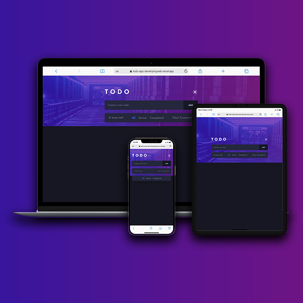

# Todo App

This project is a solution to the [Todo app challenge on Frontend Mentor](https://www.frontendmentor.io/challenges/todo-app-Su1_KokOW). Frontend Mentor challenges help you improve your coding skills by building realistic projects.

### The challenge

- Add new todos to the list
- Mark todos as complete
- Delete todos from the list
- Filter by all/active/complete todos
- Clear all completed todos
- Toggle light and dark mode
- Theme, Todo saved in the local storage
<!-- - Drag and drop to reorder items on the list -->

### Links

- [Live site](https://dacooleric-todo-app.netlify.app/)

### Built with

- CSS custom properties
- Mobile-first workflow
- [React](https://reactjs.org/) - JS library
- [Styled Components](https://styled-components.com/) - For styles

## Author

- Eric Kodzo Ayi alias Dacooleric - [@developingWeb](https://dacooleric.netlify.app/)
